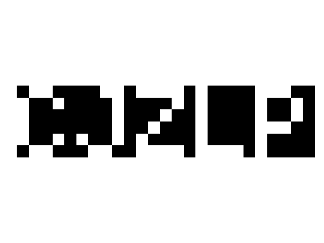

## Day 8

### Part 1

Not a difficult puzzle overall but quite fun. Stacking multiple layers, searching for hidden password in the image is enjoyable. 

Part 1 becomes trivial with python `Counter`.

```
from collections import Counter

s = input()

size = 25 * 6
layer_count = len(s) // size

layer_lst = [list(map(int, (s[size * i:size * (i + 1)])))
             for i in range(layer_count)]

counter_lst = [Counter(layer) for layer in layer_lst]

min_counter = None
min_count = float('inf')

for counter in counter_lst:
    if counter[0] < min_count:
        min_count = counter[0]
        min_counter = counter

result = min_counter[1] * min_counter[2]
print(result)
```

### Part 2

It is not easy to see the password on the console with 1s and 0s. It's so clear when plotted as image. The code in [part2.py](part2.py)


